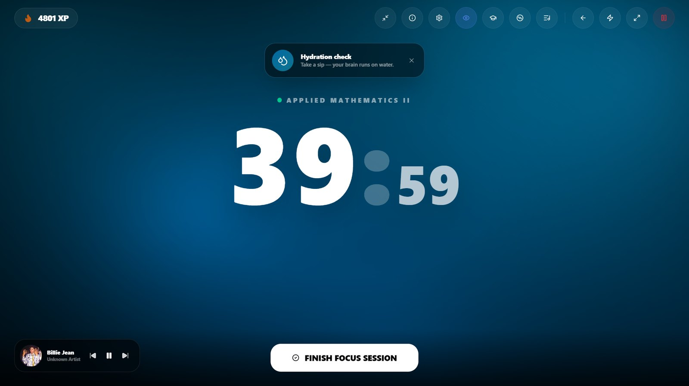

<div align="center">


**A study workstation that plans your day, times your focus, and tells you the truth about how it went.**

[](https://nextjs.org)
[](https://react.dev)
[](https://prisma.io)
[](https://electronjs.org)
[](https://github.com/leviGatimu/Study-Flow/releases/latest)

</div>

---

StudyFlow turns a school timetable into a working day. It knows which lesson you are in right now, what
you planned to study after it, and how much of that you actually finished — then scores the term honestly
instead of congratulating you for opening the app.

It runs two ways: as a **web app** backed by Postgres, and as an **offline desktop app** that carries its
own database and never needs a network.

## Focus mode



A session is a full-screen contract with yourself: one subject, one countdown, your own music, and nothing
else on screen. Hydration and posture nudges arrive on a schedule you set. Close the window and the
session survives — the timer lives in app state, not in the page.

## What's inside

| | |
|---|---|
| **Timetable-aware dashboard** | Knows whether you are in a school lesson, on a break, or in a session you scheduled — and counts down to whatever is next |
| **Focus sessions** | Full-screen timer, background audio, break prompts, and a widget mode that floats above other windows |
| **Homework & exams** | Deadlines, proof-of-work uploads, and an exam timeline scoped to the academic year |
| **AI tutor** | Explanations, quizzes and marking through Gemini, OpenAI, Anthropic, Groq or a local Ollama model |
| **Insights** | Hours studied, completion rate, streaks and per-subject mastery, with an end-of-term report card |
| **Ranks & XP** | An XP ledger with idempotency keys, so the same action can never pay twice |

<table>
<tr>
<td width="50%"></td>
<td width="50%"></td>
</tr>
</table>

## Quick start (web)

Requires Node 20+ and a Postgres database — [Supabase](https://supabase.com) is what this project uses.

```bash
git clone git@github.com:leviGatimu/study-flow-app.git
cd study-flow-app
npm install
cp .env.example .env      # then fill it in - see below
npx prisma migrate deploy
npm run dev
```

Open <http://localhost:3000>.

### Environment variables

| Variable | Required | Notes |
|---|---|---|
| `DATABASE_URL` | yes | Supabase **transaction** pooler, port `6543`, with `?pgbouncer=true`. The session pooler works locally and then exhausts connections under serverless. |
| `DIRECT_URL` | yes | Supabase **session** pooler, port `5432`. Used by Prisma for migrations. |
| `JWT_SECRET` | yes | Signs the auth cookie. `node -e "console.log(require('crypto').randomBytes(48).toString('base64url'))"` |
| `SUPABASE_URL` | on Vercel | Object storage for uploads |
| `SUPABASE_SERVICE_ROLE_KEY` | on Vercel | Server-side only — never expose it to the browser |
| `SUPABASE_STORAGE_BUCKET` | on Vercel | Create it **private**; files are served through an authenticated route |

Without the three Supabase Storage variables, uploads are written to `public/uploads` on local disk. That
is correct for local development and for the desktop build, and wrong on Vercel, where the filesystem is
ephemeral and every uploaded file disappears on the next deploy.

## Desktop app

[**Download the latest Windows installer →**](https://github.com/leviGatimu/Study-Flow/releases/latest)

The desktop build is not a browser wrapper around a hosted site. It ships the Next.js server, runs it on a
local port, and keeps everything in SQLite under `%APPDATA%\study-tracker-desktop` — so it works with no
internet at all. It checks for updates on launch and every six hours, and **Settings → Desktop app** has a
*Check for updates* button that downloads and installs on restart.

Your database, uploads and session live outside the installation directory, so installing a new version
over an old one keeps all of it.

### Building it yourself

```bash
npm run build:desktop     # SQLite client + Next build, then restores the Postgres client
cd desktop-app
npm run dist              # -> desktop-app/dist/StudyTrackerSetup.exe
```

`build:desktop` restores the Postgres Prisma client afterwards even if the build fails. The two targets
share one generated-client path, and a half-finished desktop build used to leave the web app querying
Postgres through a SQLite client.

Stop any running dev server first: it holds the Prisma engine DLL, and the build dies half-written.

See [`setup/README.txt`](setup/README.txt) for the full release procedure, including which repository the
updater actually reads.

## Architecture

```
app/            Next.js App Router - pages and server actions
components/     UI, including the dashboard status card and the nav rail
lib/            Domain logic: auth, uploads, AI providers, XP ledger, sync identity map
lib/sync/       What makes a row "the same row" across devices (groundwork for two-way sync)
prisma/         Postgres schema (source of truth) + generated SQLite schema and migrations
desktop-app/    Electron main process, preload bridge, electron-builder config
scripts/        Desktop build orchestration and schema generation
test/           Node test-runner suites, including the sync hazard harness
docs/           UI contract and images
```

**One schema, two databases.** `prisma/schema.prisma` (Postgres) is the source of truth;
`scripts/prisma-sqlite.mjs` derives the SQLite schema from it at build time, because Prisma's `provider`
cannot be an environment variable. Desktop migrations are applied by the app itself at boot
(`lib/sqlite-migrate.ts`) — a packaged Electron app has no Prisma CLI to run `migrate deploy`.

> **The web and desktop databases are separate and do not sync.** Data entered in the browser does not
> appear in the desktop app, and vice versa. Two-way sync is designed but not built:
> `lib/sync/identity.ts` declares how rows match across devices for all 28 models, and
> `test/sync/hazards.test.mjs` reproduces the four ways a naive last-writer-wins engine corrupts this
> schema. Read both before writing the transport.

## Scripts

| Command | What it does |
|---|---|
| `npm run dev` | Next dev server |
| `npm run build` | Production build (web) |
| `npm run build:desktop` | Desktop bundle: SQLite client, Next build, Postgres client restored |
| `npm run db:postgres` | Regenerate the Postgres Prisma client |
| `npm run test:sync` | Sync identity and hazard suites against real SQLite databases |
| `npm run test:sync:setup` | Regenerate the harness client — run once after any schema change |

## Design

UI changes follow [`docs/ui-contract.md`](docs/ui-contract.md): fixed radii, one accent colour, two
durations and one easing, sentence case, no decorative glow. It exists because several attempts to
"improve" the styling were rejected for reinventing each page instead of converging on one.

---

<div align="center">
<sub>Built by <a href="https://github.com/leviGatimu">leviGatimu</a></sub>
</div>
